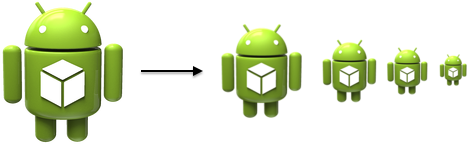

android-scripts
===============

Utility scripts for Android development.

## andimg

<p align="center" >
  
</p>

Resize an image for multiple screen densities.   

* Resized images are placed in `drawable-*dpi` directories.
* Generates `XXHDPI`, `XHDPI`, `HDPI` and `MDPI` variants.

### Dependencies

imagemagick, python 2.7+

### Usage
```
andimg [-h] [-o OUT] [-e EXT] file x y

  file                  Source file to be resized.
  x                     Target X resolution for mdpi (1x) image.
  y                     Target Y resolution for mdpi (1x) image.
  -o OUT, --output-dir OUT
                        Output directory.
  -e EXT, --extension EXT
                        Output file extension. Defaults to PNG.
```

### Examples

From the root of a project, resize an image from `artwork`, and put it in the `src/main/res` directory:

`andimg -o src/main/res artwork/icon.png 32 32` 
